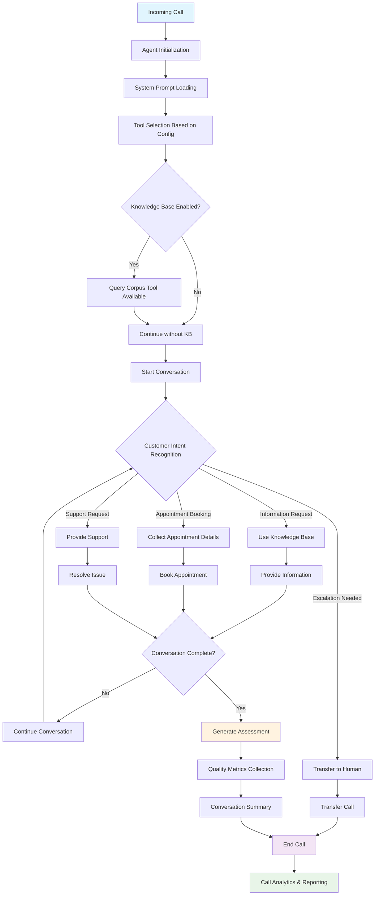

# AI Voice Agent - Inbound Bot

An intelligent voice agent built with Ultravox for handling inbound customer calls with advanced conversation capabilities, appointment booking, call transfers, and quality assessment.

## Features

### 🎯 Core Capabilities
- **Intelligent Voice Conversations**: Powered by Ultravox AI model
- **Real-time Call Processing**: Handle inbound calls with natural language understanding
- **Quality Assessment**: 17-parameter self-assessment system for conversation quality
- **Flexible Configuration**: Customizable features based on business needs

### 🛠️ Available Tools

#### 1. **Knowledge Base Integration**
- RAG (Retrieval Augmented Generation) support
- Query company-specific knowledge corpus
- Returns up to 5 relevant results per query

#### 2. **Appointment Booking**
- Collect customer information (name, contact, email)
- Schedule appointments with date/time validation
- Generate conversation summaries
- Email notifications support

#### 3. **Call Transfer & Escalation**
- Transfer calls to human agents
- Provide transfer context and conversation summary
- Configurable forwarding numbers

#### 4. **Call Management**
- Automatic call termination
- Configurable maximum call duration
- Call recording and transcription options

## Flow Diagram



## Configuration

### Environment Variables
```bash
# Base configuration
TOOLS_BASE_URL=your_tools_base_url

# Database and API configurations
# Add your specific environment variables here
```

### Call Configuration Parameters

| Parameter | Type | Description |
|-----------|------|-------------|
| `systemPrompt` | string | Custom system prompt for the agent |
| `voice` | string | TTS voice selection |
| `temperature` | number | Response variability (0.0-1.0) |
| `maxDuration` | string | Maximum call duration (e.g., "300s") |
| `recordingEnabled` | boolean | Enable call recording |
| `transcriptOptional` | boolean | Enable call transcription |

### Feature Toggles

| Feature | Parameter | Description |
|---------|-----------|-------------|
| Knowledge Base | `use_knowlege_base` | Enable RAG functionality |
| Appointment Booking | `is_book_appointment` | Enable appointment scheduling |
| Call Transfer | `is_transfercall` | Enable human agent escalation |
| Email Notifications | `notification_email` | Enable email alerts |

## Quality Assessment Metrics

The agent automatically evaluates conversations across 17 parameters (1-4 scale):

### Performance Metrics
- **Response Accuracy** (1-4): AI's self-assessed accuracy
- **Knowledge Limitation Handling** (1-4): How well AI handled knowledge gaps
- **Confidence and Clarity** (1-4): Response clarity and confidence
- **Tone and Empathy** (1-4): Appropriate emotional response

### Customer Experience
- **Customer Satisfaction Outcome** (1-4): Final customer sentiment
- **Customer Behavior** (1-4): Customer's tone throughout call
- **Customer Effort Level** (1-4): Effort required to get help
- **Conversation Completion** (1-4): Query resolution completeness

### Technical Quality
- **Background Noise Level (Customer)** (1-4): Audio quality assessment
- **Background Noise Level (AI)** (1-4): System audio quality
- **Call Disruption** (1-4): Impact of audio issues
- **Overall Conversation Quality** (1-4): Comprehensive quality rating

### Call Analytics
- **Call Intent** (1-4): Primary call purpose classification
- **Caller Tone and Empathy** (1-4): Customer's emotional state
- **Emotional Shift** (1-4): Conversation emotional trajectory

## Setup Instructions

### 1. Installation
```bash
# Clone the repository
git clone <repository-url>
cd voiceai-inbound-bot

# Install dependencies
npm install
```

### 2. Configuration
```bash
# Copy environment template
cp .env.example .env

# Edit configuration
nano .env
```

### 3. Running the Agent
```bash
# Start the application
npm start

# Development mode
npm run dev
```

## API Integration

### Appointment Booking Endpoint
```
POST ${TOOLS_BASE_URL}/whook/bookAppointment
```

### Call Transfer Endpoint
```
POST ${TOOLS_BASE_URL}/twilio/transferCall
```

### Call Termination Endpoint
```
POST ${TOOLS_BASE_URL}/twilio/hangUpCall
```

## Usage Examples

### Basic Call Configuration
```javascript
const config = await createUltravoxCallConfig(
  systemPrompt,
  voice,
  companyName,
  fromNumber,
  toNumber,
  temperature,
  isTranscriptEnabled,
  isRecordingEnabled,
  transferNumber,
  companyId,
  email,
  emailNotification,
  emailAddress,
  isTransferEnabled,
  isAppointmentEnabled,
  isNotesEnabled,
  isReminderEnabled,
  maxCallDuration,
  knowledgeBaseId,
  useKnowledgeBase
);
```

### Enabling Knowledge Base
```javascript
const tools = createSelectedTools(
  from,
  to,
  true,  // Enable appointments
  true,  // Enable transfers
  transferNumber,
  companyName,
  companyId,
  false, // Notes
  false, // Reminders
  "kb_123", // Knowledge base ID
  true   // Use knowledge base
);
```

## Monitoring and Analytics

### Call Metadata
Each call generates comprehensive metadata including:
- Call direction and participants
- Feature usage statistics
- Quality assessment scores
- Customer satisfaction metrics
- Technical performance data

### Conversation Summaries
- Automatic generation for all completed calls
- Transfer context for escalated calls
- Appointment booking confirmations

## Troubleshooting

### Common Issues
1. **Audio Quality Problems**: Check network connectivity and bandwidth
2. **Knowledge Base Not Responding**: Verify knowledge base ID and permissions
3. **Transfer Failures**: Confirm forwarding number configuration
4. **Appointment Booking Errors**: Validate date/time format requirements

### Debug Mode
Enable detailed logging by setting:
```javascript
console.log('Creating selected tools with use_knowlege_base:', use_knowlege_base, 'and knowlege_base_id:', knowlege_base_id);
```

## Contributing

1. Fork the repository
2. Create a feature branch
3. Make your changes
4. Add tests if applicable
5. Submit a pull request

## License

[Add your license information here]

## Support

For support and questions:
- Create an issue in the repository
- Contact the development team
- Check the documentation for common solutions