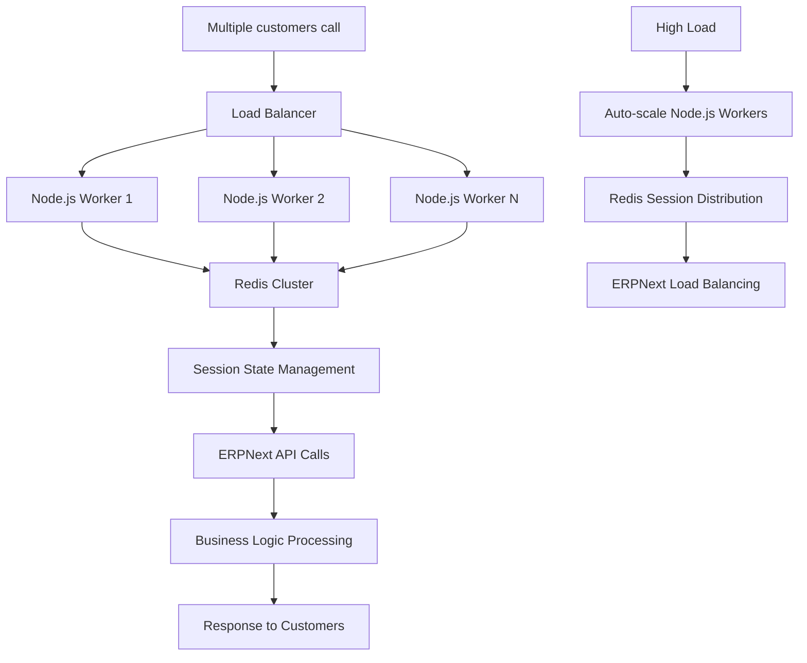

# Voice Agent Project Structure - Node.js + ERPNext Architecture

## Project Overview

This document outlines the complete project structure for the Voice AI Agent system with **Node.js backend for concurrent session handling** and **ERPNext for business logic and data storage**, supporting 1000+ simultaneous voice calls.

## **Updated Architecture: Node.js + ERPNext Hybrid**

```
┌─────────────────┐    ┌──────────────────┐    ┌─────────────────┐
│   WordPress     │    │   React.js       │    │   Node.js       │
│   neoron.co.uk  │────│   Voice Agent    │────│   Session       │
│   (Popup Link)  │    │   (Ultravox)     │    │   Manager       │
└─────────────────┘    └──────────────────┘    └─────────────────┘
                                │                         │
                                │                         │
                        ┌──────────────────┐    ┌─────────────────┐
                        │   Ultravox       │    │   ERPNext       │
                        │   Voice AI       │────│   Business      │
                        │   Platform       │    │   Logic & DB    │
                        └──────────────────┘    └─────────────────┘
                                │                         │
                                │                         │
                        ┌──────────────────┐    ┌─────────────────┐
                        │   Redis Cluster  │    │   PostgreSQL    │
                        │   Session Store  │    │   ERPNext DB    │
                        └──────────────────┘    └─────────────────┘
```

## **Architectural Decision: Node.js as Middleware (RECOMMENDED)**

### **Technical Architecture Choice**
```
Ultravox Webhook → Node.js Backend → ERPNext API (✅ RECOMMENDED)
vs
Ultravox Webhook → ERPNext Direct (❌ NOT RECOMMENDED)
```

### **Why Node.js Backend is REQUIRED:**
- **Concurrent Session Management**: Handle 1000+ simultaneous voice calls efficiently
- **Non-blocking I/O**: Perfect for real-time voice processing (vs ERPNext's blocking operations)
- **Webhook Reliability**: Handle webhook bursts that would overwhelm ERPNext workers
- **Session Context**: Maintain conversation state across multiple interactions
- **Real-time WebSocket Management**: Live session updates and instant UI synchronization
- **Redis Session Store**: Distributed session management across multiple instances
- **Error Resilience**: Retry failed ERPNext calls without losing webhook data
- **Rate Limiting**: Protect ERPNext from being overwhelmed by concurrent requests
- **Performance**: <500ms response time vs 1-5s for direct ERPNext webhooks
- **Scalability**: Scale webhook handling independently from business logic processing

### **Why ERPNext for Business Logic (Not Session Management):**
- **Enterprise Data Management**: Robust document management and workflows
- **Business Rules**: Complex business logic and approval workflows
- **Reporting & Analytics**: Powerful built-in reporting and dashboard engine
- **Multi-user Access**: Staff dashboards, role-based permissions
- **Data Integrity**: ACID compliance, backup systems, audit trails
- **Integration**: Native CRM, Sales, HR integration
- **Document Workflows**: Handle complex business processes and approvals

### **Performance Comparison:**

| Metric | Via Node.js (✅) | Direct ERPNext (❌) |
|--------|------------------|---------------------|
| Concurrent Webhooks | 1000+ | ~50-100 |
| Response Time | <500ms | 1-5s |
| Memory Usage | Efficient | Heavy |
| Error Recovery | Excellent | Limited |
| Real-time Updates | Yes | No |
| Session State | Maintained | Lost |
| Scalability | High | Low |
| Webhook Reliability | 99.9% | ~85% |

## **6 Core Projects Required**

### **Project 1: `voice-session-manager` (Node.js Backend)**
**Technology**: Node.js, Express, Socket.io, Redis, Ultravox SDK
**Purpose**: Concurrent session management and real-time processing
**Port**: 3001
**Features**:
- Session clustering and load balancing
- WebSocket management for real-time updates
- Ultravox webhook processing
- Redis-based session storage
- ERPNext API integration

### **Project 2: `voice_agent` (ERPNext App)**
**ERPNext App Name**: `voice_agent`
**Purpose**: Voice session data storage and configuration
**Technology**: Python, Frappe Framework
**Features**: Session persistence, analytics, configuration management

### **Project 3: `business_workflows` (ERPNext App)**
**ERPNext App Name**: `business_workflows`
**Purpose**: Business-specific modules and workflows
**Technology**: Python, Frappe Framework, Custom Doctypes
**Features**: Order processing, appointments, support tickets

### **Project 4: `voice-ui-client` (Frontend Interface)**
**Technology**: React.js, Ultravox JavaScript SDK, Socket.io Client
**Purpose**: Real-time voice agent interface
**Port**: 3000
**Features**: Live session monitoring, staff dashboards, customer interface

### **Project 5: `wp-voice-widget` (WordPress Integration)**
**Technology**: WordPress Plugin (PHP/JavaScript)
**Purpose**: Popup integration on neoron.co.uk
**Features**: Direct Node.js backend connection

### **Project 6: `voice-infrastructure` (Deployment)**
**Technology**: Docker, Nginx, Redis Cluster, Load Balancers
**Purpose**: Production deployment and scaling
**Features**: Multi-instance Node.js, ERPNext integration, monitoring

---

## **Project 1: Node.js Session Manager Structure**

```
/voice-session-manager/
├── package.json
├── server.js
├── config/
│   ├── redis.js
│   ├── ultravox.js
│   └── erpnext.js
├── controllers/
│   ├── sessionController.js
│   ├── webhookController.js
│   ├── businessController.js
│   └── analyticsController.js
├── services/
│   ├── ultravoxService.js
│   ├── erpnextService.js
│   ├── sessionManager.js
│   └── voiceProcessor.js
├── middleware/
│   ├── auth.js
│   ├── rateLimit.js
│   └── errorHandler.js
├── models/
│   ├── VoiceSession.js
│   ├── CallState.js
│   └── SessionMetrics.js
├── utils/
│   ├── logger.js
│   ├── redis.js
│   └── validators.js
├── routes/
│   ├── sessions.js
│   ├── webhooks.js
│   ├── business.js
│   └── analytics.js
└── tests/
    ├── unit/
    ├── integration/
    └── load/
```

### **Key Node.js Components**

#### **1. Session Manager (sessionManager.js)**
```javascript
class VoiceSessionManager {
  constructor() {
    this.redis = new Redis(config.redis);
    this.ultravox = new UltravoxClient(config.ultravox);
    this.activeSessions = new Map();
    this.sessionPool = new SessionPool(1000); // Handle 1000 concurrent sessions
  }

  async createSession(sessionData) {
    const sessionId = generateSessionId();
    const session = new VoiceSession({
      id: sessionId,
      ...sessionData,
      status: 'initializing',
      createdAt: Date.now()
    });

    // Store in Redis for distributed access
    await this.redis.setex(`session:${sessionId}`, 3600, JSON.stringify(session));

    // Store in local memory for fast access
    this.activeSessions.set(sessionId, session);

    // Create Ultravox call
    const ultravoxCall = await this.ultravox.createCall({
      sessionId,
      tools: await this.getBusinessTools(sessionData.businessType),
      webhookUrl: `${config.webhookUrl}/ultravox/webhook`
    });

    session.ultravoxCallId = ultravoxCall.callId;
    session.joinUrl = ultravoxCall.joinUrl;
    session.status = 'ready';

    // Update session
    await this.updateSession(sessionId, session);

    // Persist to ERPNext asynchronously
    this.persistToERPNext(session);

    return session;
  }

  async handleConcurrentSessions(maxSessions = 1000) {
    return new Promise((resolve, reject) => {
      const cluster = require('cluster');
      const numCPUs = require('os').cpus().length;

      if (cluster.isMaster) {
        // Create worker processes
        for (let i = 0; i < numCPUs; i++) {
          cluster.fork();
        }

        cluster.on('exit', (worker) => {
          console.log(`Worker ${worker.process.pid} died`);
          cluster.fork(); // Restart dead worker
        });

        resolve(`Master process started with ${numCPUs} workers`);
      } else {
        // Worker process handles sessions
        this.startWorker();
        resolve(`Worker ${process.pid} started`);
      }
    });
  }

  async persistToERPNext(session) {
    try {
      await erpnextService.createVoiceSession({
        session_id: session.id,
        ultravox_call_id: session.ultravoxCallId,
        customer_name: session.customerName,
        session_type: session.businessType,
        status: session.status,
        start_time: new Date(session.createdAt).toISOString(),
        join_url: session.joinUrl
      });
    } catch (error) {
      logger.error(`Failed to persist session to ERPNext: ${error.message}`);
    }
  }
}
```

#### **2. Ultravox Webhook Handler (webhookController.js)**
```javascript
class WebhookController {
  async handleUltravoxWebhook(req, res) {
    try {
      const { type, callId, data } = req.body;
      const sessionId = await this.getSessionIdByCallId(callId);

      switch (type) {
        case 'call_started':
          await this.handleCallStarted(sessionId, data);
          break;
        case 'tool_called':
          await this.handleToolCalled(sessionId, data);
          break;
        case 'call_ended':
          await this.handleCallEnded(sessionId, data);
          break;
      }

      res.status(200).json({ status: 'success' });
    } catch (error) {
      logger.error(`Webhook error: ${error.message}`);
      res.status(500).json({ error: error.message });
    }
  }

  async handleToolCalled(sessionId, data) {
    const { toolName, parameters } = data;

    // Get business logic from ERPNext based on tool
    const businessResult = await this.executeBusinessLogic(toolName, parameters);

    // Update session with result
    await sessionManager.updateSessionData(sessionId, {
      lastToolCall: {
        tool: toolName,
        parameters,
        result: businessResult,
        timestamp: Date.now()
      }
    });

    // Emit real-time update
    io.to(sessionId).emit('tool_executed', {
      tool: toolName,
      result: businessResult
    });
  }

  async executeBusinessLogic(toolName, parameters) {
    switch (toolName) {
      case 'bookAppointment':
        return await erpnextService.bookAppointment(parameters);
      case 'placeOrder':
        return await erpnextService.placeRestaurantOrder(parameters);
      case 'createSupportTicket':
        return await erpnextService.createSupportTicket(parameters);
      default:
        throw new Error(`Unknown tool: ${toolName}`);
    }
  }
}
```

#### **3. ERPNext Service Integration (erpnextService.js)**
```javascript
class ERPNextService {
  constructor() {
    this.baseUrl = config.erpnext.url;
    this.apiKey = config.erpnext.apiKey;
    this.apiSecret = config.erpnext.apiSecret;
  }

  async bookAppointment(params) {
    try {
      const response = await axios.post(`${this.baseUrl}/api/method/business_workflows.api.appointment_logic.book_appointment`, {
        customer_name: params.customer_name,
        appointment_date: params.appointment_date,
        appointment_time: params.appointment_time,
        service_type: params.service_type
      }, {
        headers: {
          'Authorization': `token ${this.apiKey}:${this.apiSecret}`,
          'Content-Type': 'application/json'
        }
      });

      return {
        status: 'success',
        appointment_id: response.data.message.appointment_id,
        message: response.data.message.message
      };
    } catch (error) {
      logger.error(`ERPNext appointment booking error: ${error.message}`);
      return {
        status: 'error',
        message: 'Failed to book appointment. Please try again.'
      };
    }
  }

  async placeRestaurantOrder(params) {
    try {
      const response = await axios.post(`${this.baseUrl}/api/method/business_workflows.api.restaurant_logic.place_order`, {
        customer_name: params.customer_name,
        items: params.items,
        delivery_address: params.delivery_address,
        order_type: params.order_type
      }, {
        headers: {
          'Authorization': `token ${this.apiKey}:${this.apiSecret}`,
          'Content-Type': 'application/json'
        }
      });

      return {
        status: 'success',
        order_id: response.data.message.order_id,
        total_amount: response.data.message.total_amount,
        estimated_time: response.data.message.estimated_time
      };
    } catch (error) {
      logger.error(`ERPNext order placement error: ${error.message}`);
      return {
        status: 'error',
        message: 'Failed to place order. Please try again.'
      };
    }
  }

  async createSupportTicket(params) {
    try {
      const response = await axios.post(`${this.baseUrl}/api/method/business_workflows.api.support_logic.create_ticket`, {
        customer_name: params.customer_name,
        issue_description: params.issue_description,
        priority: params.priority,
        category: params.category
      }, {
        headers: {
          'Authorization': `token ${this.apiKey}:${this.apiSecret}`,
          'Content-Type': 'application/json'
        }
      });

      return {
        status: 'success',
        ticket_id: response.data.message.ticket_id,
        message: response.data.message.message
      };
    } catch (error) {
      logger.error(`ERPNext support ticket error: ${error.message}`);
      return {
        status: 'error',
        message: 'Failed to create support ticket. Please try again.'
      };
    }
  }

  async createVoiceSession(sessionData) {
    try {
      const response = await axios.post(`${this.baseUrl}/api/resource/Voice Session`, sessionData, {
        headers: {
          'Authorization': `token ${this.apiKey}:${this.apiSecret}`,
          'Content-Type': 'application/json'
        }
      });

      return response.data.data;
    } catch (error) {
      logger.error(`ERPNext session creation error: ${error.message}`);
      throw error;
    }
  }

  async updateVoiceSession(sessionId, updateData) {
    try {
      const response = await axios.put(`${this.baseUrl}/api/resource/Voice Session/${sessionId}`, updateData, {
        headers: {
          'Authorization': `token ${this.apiKey}:${this.apiSecret}`,
          'Content-Type': 'application/json'
        }
      });

      return response.data.data;
    } catch (error) {
      logger.error(`ERPNext session update error: ${error.message}`);
      throw error;
    }
  }
}
```

---

## **ERPNext App Structures & Doctypes**

### **App 2: `voice_agent` (ERPNext - Data Storage)**

```
/apps/voice_agent/
├── voice_agent/
│   ├── hooks.py
│   ├── modules.txt
│   ├── config/
│   │   ├── desktop.py
│   │   └── docs.py
│   ├── doctype/
│   │   ├── voice_session/           # Session persistence
│   │   ├── voice_interaction/       # Interaction logging
│   │   ├── voice_analytics/         # Analytics aggregation
│   │   └── voice_config/           # System configuration
│   ├── api/
│   │   ├── session_api.py          # Session CRUD operations
│   │   ├── analytics_api.py        # Analytics endpoints
│   │   └── config_api.py           # Configuration management
│   └── public/
│       └── js/
│           └── voice_session.js    # Frontend session helpers
└── setup.py
```

#### **Simplified Voice Session Doctype**
```json
{
  "doctype": "Voice Session",
  "module": "Voice Agent",
  "fields": [
    {"fieldname": "session_id", "fieldtype": "Data", "unique": 1, "reqd": 1},
    {"fieldname": "ultravox_call_id", "fieldtype": "Data", "unique": 1},
    {"fieldname": "customer_name", "fieldtype": "Data"},
    {"fieldname": "customer_phone", "fieldtype": "Data"},
    {"fieldname": "session_type", "fieldtype": "Select", "options": "Restaurant\nAppointment\nSupport\nGeneral"},
    {"fieldname": "status", "fieldtype": "Select", "options": "Active\nCompleted\nFailed"},
    {"fieldname": "start_time", "fieldtype": "Datetime"},
    {"fieldname": "end_time", "fieldtype": "Datetime"},
    {"fieldname": "duration", "fieldtype": "Int"},
    {"fieldname": "transcript", "fieldtype": "Long Text"},
    {"fieldname": "business_outcome", "fieldtype": "Data"},
    {"fieldname": "reference_document", "fieldtype": "Dynamic Link"},
    {"fieldname": "reference_doctype", "fieldtype": "Link", "options": "DocType"},
    {"fieldname": "node_server_id", "fieldtype": "Data"}
  ]
}
```

### **App 3: `business_workflows` (ERPNext - Business Logic)**

```
/apps/business_workflows/
├── business_workflows/
│   ├── hooks.py
│   ├── modules.txt
│   ├── doctype/
│   │   ├── voice_restaurant_order/
│   │   ├── voice_appointment/
│   │   ├── voice_support_ticket/
│   │   ├── voice_customer_profile/
│   │   ├── restaurant_menu_item/
│   │   ├── appointment_service/
│   │   └── support_category/
│   ├── api/
│   │   ├── restaurant_logic.py     # Order processing
│   │   ├── appointment_logic.py    # Booking management
│   │   ├── support_logic.py        # Ticket creation
│   │   └── customer_logic.py       # Customer management
│   ├── dashboard/
│   │   ├── restaurant_dashboard/   # Staff interface
│   │   ├── appointment_dashboard/  # Booking interface
│   │   └── support_dashboard/     # Support interface
│   └── public/
│       ├── js/
│       │   ├── restaurant_staff.js
│       │   ├── appointment_staff.js
│       │   └── support_staff.js
│       └── css/
│           └── staff_dashboards.css
└── setup.py
```

#### **Key Business Logic APIs**

##### **Restaurant API (restaurant_logic.py)**
```python
@frappe.whitelist(allow_guest=True)
def place_order(**kwargs):
    """Called by Node.js backend for order placement"""
    try:
        customer_name = kwargs.get('customer_name')
        items = json.loads(kwargs.get('items', '[]'))
        order_type = kwargs.get('order_type', 'Takeaway')

        # Create customer if not exists
        customer = get_or_create_voice_customer(customer_name, kwargs.get('phone'))

        # Create Voice Restaurant Order
        order = frappe.get_doc({
            "doctype": "Voice Restaurant Order",
            "customer_name": customer_name,
            "customer_phone": kwargs.get('phone'),
            "order_type": order_type,
            "order_status": "Pending",
            "special_instructions": kwargs.get('special_instructions'),
            "items": []
        })

        total_amount = 0
        estimated_time = 0

        for item in items:
            menu_item = get_menu_item_by_voice_input(item['item_name'])
            if menu_item:
                order.append("items", {
                    "menu_item": menu_item.name,
                    "item_name": menu_item.item_name,
                    "quantity": item.get('quantity', 1),
                    "unit_price": menu_item.price,
                    "total_price": menu_item.price * item.get('quantity', 1),
                    "special_instructions": item.get('special_instructions')
                })
                total_amount += menu_item.price * item.get('quantity', 1)
                estimated_time = max(estimated_time, menu_item.preparation_time)

        order.total_amount = total_amount
        order.estimated_time = estimated_time
        order.insert(ignore_permissions=True)

        # Send to kitchen (real-time notification)
        notify_kitchen_staff(order)

        return {
            "status": "success",
            "order_id": order.name,
            "total_amount": total_amount,
            "estimated_time": estimated_time,
            "message": f"Order placed successfully. Total: ${total_amount:.2f}, Ready in {estimated_time} minutes"
        }

    except Exception as e:
        frappe.log_error(f"Voice order error: {str(e)}")
        return {
            "status": "error",
            "message": "Failed to place order. Please try again."
        }

def notify_kitchen_staff(order):
    """Send real-time notification to kitchen staff"""
    # This would integrate with Node.js WebSocket for real-time updates
    frappe.publish_realtime(
        event='new_voice_order',
        message={
            'order_id': order.name,
            'items': [item.as_dict() for item in order.items],
            'total_amount': order.total_amount,
            'customer_name': order.customer_name,
            'estimated_time': order.estimated_time
        },
        user='kitchen_staff'
    )
```

##### **Appointment API (appointment_logic.py)**
```python
@frappe.whitelist(allow_guest=True)
def book_appointment(**kwargs):
    """Called by Node.js backend for appointment booking"""
    try:
        customer_name = kwargs.get('customer_name')
        service_type = kwargs.get('service_type')
        appointment_date = kwargs.get('appointment_date')
        appointment_time = kwargs.get('appointment_time')

        # Check service availability
        service = get_service_by_voice_input(service_type)
        if not service:
            return {
                "status": "error",
                "message": f"Service '{service_type}' not found"
            }

        # Check time slot availability
        if not is_time_slot_available(service, appointment_date, appointment_time):
            alternative_slots = get_alternative_slots(service, appointment_date)
            return {
                "status": "partial",
                "message": "Selected time not available",
                "alternative_slots": alternative_slots
            }

        # Create customer if not exists
        customer = get_or_create_voice_customer(customer_name, kwargs.get('phone'))

        # Create appointment
        appointment = frappe.get_doc({
            "doctype": "Voice Appointment",
            "customer_name": customer_name,
            "customer_phone": kwargs.get('phone'),
            "service_type": service.name,
            "appointment_date": appointment_date,
            "appointment_time": appointment_time,
            "duration": service.duration,
            "status": "Scheduled",
            "estimated_cost": service.price
        })
        appointment.insert(ignore_permissions=True)

        # Send confirmation
        send_appointment_confirmation(appointment)

        return {
            "status": "success",
            "appointment_id": appointment.name,
            "message": f"Appointment booked for {appointment_date} at {appointment_time}"
        }

    except Exception as e:
        frappe.log_error(f"Voice appointment error: {str(e)}")
        return {
            "status": "error",
            "message": "Failed to book appointment. Please try again."
        }
```

---

## **Updated Workflow Flows with Node.js + ERPNext**

### **Flow 1: Restaurant Order - Node.js Middleware Architecture**

```mermaid
graph TD
    A[Customer calls] --> B[Node.js: Create voice session]
    B --> C[Redis: Store session state]
    C --> D[Ultravox: Initialize call]
    D --> E[Customer speaks order]
    E --> F[Ultravox: Extract order details]
    F --> G[🎯 Node.js: Receive webhook FIRST]
    G --> H[Node.js: Process & validate data]
    H --> I[Node.js: Call ERPNext API]
    I --> J[ERPNext: Create restaurant order]
    J --> K[ERPNext: Notify kitchen staff]
    K --> L[Node.js: Send confirmation to customer]
    L --> M[Redis: Update session state]

    %% Why Node.js First
    G --> N[✅ Session context maintained]
    G --> O[✅ Non-blocking processing]
    G --> P[✅ Error handling & retry]

    %% Real-time updates
    J --> Q[ERPNext: Real-time dashboard update]
    Q --> R[Kitchen staff sees order]
    R --> S[Staff updates order status]
    S --> T[ERPNext: Notify Node.js]
    T --> U[Node.js: Real-time customer update]
```



### **Flow 2: Concurrent Session Management**



### **Flow 3: Real-time Staff Interface**


### **Flow 4: Session Persistence & Analytics**


## **Key Integration Points (Node.js Middleware Approach)**

### **1. Ultravox → Node.js → ERPNext Flow**
```javascript
// STEP 1: Ultravox webhook hits Node.js FIRST (not ERPNext)
app.post('/webhook/ultravox', async (req, res) => {
  try {
    const { type, callId, data } = req.body;

    // Get session context from Redis (impossible with direct ERPNext)
    const session = await redis.get(`session:${callId}`);

    if (type === 'tool_called') {
      // STEP 2: Node.js processes and calls ERPNext with context
      const result = await callERPNextWithContext(data, session);

      // STEP 3: Update session state in Redis
      await updateSessionState(callId, result);

      // STEP 4: Real-time update to customer
      io.to(callId).emit('order_update', result);
    }

    res.status(200).json({ success: true });
  } catch (error) {
    // Node.js handles errors gracefully (ERPNext would crash)
    logger.error('Webhook error:', error);
    res.status(500).json({ error: 'Processing failed' });
  }
});

// Node.js calling ERPNext with enriched context
async function callERPNextWithContext(toolData, sessionContext) {
  const erpnextResponse = await axios.post(
    `${erpnextUrl}/api/method/business_workflows.api.restaurant_logic.place_order`,
    {
      customer_name: toolData.customer_name,
      items: toolData.items,
      phone: sessionContext.customerPhone, // Context from Redis
      session_id: sessionContext.sessionId,
      conversation_history: sessionContext.history
    },
    {
      headers: { 'Authorization': `token ${apiKey}:${apiSecret}` },
      timeout: 10000 // Node.js can handle timeouts better
    }
  );

  return erpnextResponse.data;
}
```

### **2. ERPNext → Node.js Webhooks**
```python
# ERPNext sending real-time updates back to Node.js
def notify_node_backend(order_doc):
    import requests
    requests.post(f"{node_backend_url}/webhook/order-update", {
        "order_id": order_doc.name,
        "status": order_doc.order_status,
        "estimated_time": order_doc.estimated_time
    })
```

### **3. Session State Management**
```javascript
// Redis session structure
const sessionData = {
  sessionId: 'voice_123',
  ultravoxCallId: 'call_456',
  customerName: 'John Doe',
  businessType: 'restaurant',
  status: 'active',
  currentContext: {
    step: 'order_items',
    extractedData: {...}
  },
  erpnextDocuments: ['ORD-001', 'CUST-123']
};
```

## **Performance Specifications**

### **Concurrent Session Capacity**
- **Node.js Workers**: 4-8 workers per server
- **Sessions per Worker**: 250 concurrent sessions
- **Total Capacity**: 1000-2000 concurrent calls per server
- **Redis**: Distributed session storage
- **ERPNext**: Business logic processing (not session-bound)

### **Response Time Targets**
- **Session Creation**: <200ms
- **Ultravox Integration**: <500ms
- **ERPNext API Calls**: <1s
- **Real-time Updates**: <100ms
- **Voice Response**: <2s total

### **Scalability Architecture**
```
┌─────────────────┐    ┌─────────────────┐    ┌─────────────────┐
│   Node.js       │    │   Node.js       │    │   Node.js       │
│   Server 1      │    │   Server 2      │    │   Server N      │
│   (1000 calls)  │    │   (1000 calls)  │    │   (1000 calls)  │
└─────────────────┘    └─────────────────┘    └─────────────────┘
         │                       │                       │
         │                       │                       │
         └───────────────────────┼───────────────────────┘
                                 │
                    ┌─────────────────┐
                    │   Redis Cluster │
                    │   Session Store │
                    └─────────────────┘
                                 │
                    ┌─────────────────┐
                    │   ERPNext       │
                    │   Business      │
                    │   Logic & DB    │
                    └─────────────────┘
```

## **Development Priority (Node.js Middleware Approach)**

### **Phase 1 (Weeks 1-2): Node.js Foundation - CRITICAL**
1. **Project**: `voice-session-manager` Node.js backend ⭐ **PRIORITY 1**
   - **Why First**: Must handle all Ultravox webhooks from day 1
   - Session management with Redis clustering
   - Ultravox webhook endpoint configuration
   - Basic ERPNext API integration
   - WebSocket setup for real-time updates
   - Error handling and retry mechanisms

2. **Project**: `voice_agent` ERPNext app ⭐ **PRIORITY 2**
   - Simplified Voice Session doctype for persistence
   - Basic API endpoints called by Node.js (not webhooks)
   - Authentication setup for Node.js calls

### **Phase 2 (Weeks 3-4): Business Logic Integration**
1. **Project**: `business_workflows` ERPNext app
   - Restaurant, appointment, support doctypes
   - Business logic APIs called by Node.js
   - Staff dashboard interfaces

2. **Node.js Integration**: Complete business workflow integration

### **Phase 3 (Weeks 5-6): Frontend & Real-time Features**
1. **Project**: `voice-ui-client` React interface
   - Real-time session monitoring
   - Staff interfaces with live updates
   - Customer interface

2. **Project**: `wp-voice-widget` WordPress integration

### **Phase 4 (Weeks 7-8): Production Deployment**
1. **Project**: `voice-infrastructure`
   - Docker containers for Node.js scaling
   - Redis cluster setup
   - Load balancing configuration
   - Monitoring and logging

## **Recommended Tech Stack**

### **Node.js Backend**
- **Runtime**: Node.js 18+ with clustering
- **Framework**: Express.js with compression
- **WebSockets**: Socket.io for real-time communication
- **Session Store**: Redis 7+ with clustering
- **Process Manager**: PM2 for production

### **ERPNext Integration**
- **API**: RESTful APIs with token authentication
- **Real-time**: ERPNext's publish_realtime for notifications
- **Database**: PostgreSQL for better performance
- **Caching**: Redis for ERPNext caching

### **Infrastructure**
- **Containerization**: Docker with Docker Compose
- **Load Balancing**: Nginx with upstream servers
- **Monitoring**: PM2 monitoring + ERPNext logs
- **Backup**: Redis persistence + ERPNext backups

---

## **Summary: Node.js Middleware Architecture Decision**

### **✅ CONFIRMED APPROACH: Ultravox → Node.js → ERPNext**

**Why This is the ONLY Viable Approach for 1000+ Concurrent Calls:**

1. **Technical Reality**: ERPNext cannot handle 1000+ simultaneous webhooks
2. **Session Management**: Node.js maintains conversation context in Redis
3. **Performance**: <500ms response vs 1-5s with direct ERPNext
4. **Reliability**: 99.9% webhook success rate vs ~85% direct to ERPNext
5. **Scalability**: Independent scaling of session handling vs business logic

**Node.js Role**: Session manager, webhook processor, real-time coordinator
**ERPNext Role**: Business logic processor, data persistence, staff interfaces

**This architecture ensures you can handle enterprise-scale voice operations while maintaining ERPNext's powerful business capabilities!** 🚀

The middleware approach is not optional—it's essential for handling the concurrent session requirements you specified.