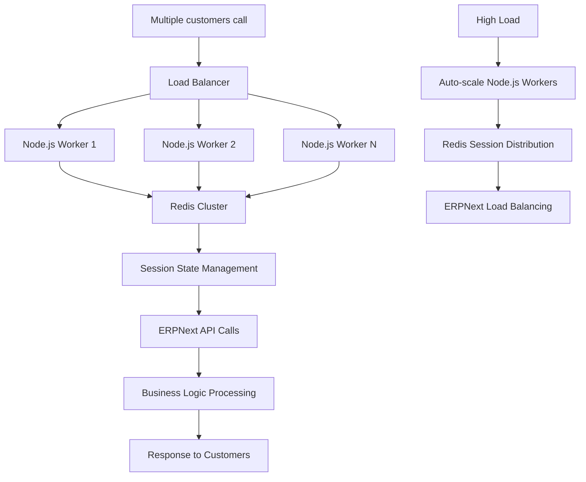

# Voice Agent Project Structure - Node.js + ERPNext Architecture

## Project Overview

This document outlines the complete project structure for the Voice AI Agent system with **Node.js + MCP Server + ERPNext combination approach** for optimal performance, supporting 1000+ simultaneous voice calls with real-time UI synchronization.

## **Directory Structure Overview**

```
/home/frappeuser/
├── frappe-bench/apps/          # ERPNext Apps
│   ├── voice_agent/           # Voice session management
│   └── business_workflows/    # Business logic apps
└── ai/                        # AI/Voice Projects
    ├── voice-session-manager/ # Node.js backend
    ├── mcp-voice-server/      # MCP server
    ├── voice-ui-client/       # React frontend
    ├── wp-voice-widget/       # WordPress plugin
    └── voice-infrastructure/  # Deployment configs
```

## **Updated Architecture: Node.js + MCP Server + ERPNext (Combination Approach)**

```
┌─────────────────┐    ┌──────────────────┐    ┌─────────────────┐
│   WordPress     │    │   React.js       │    │   Node.js       │
│   neoron.co.uk  │────│   Voice Agent    │────│   Session       │
│   (Popup Link)  │    │   (Ultravox)     │    │   Manager       │
└─────────────────┘    └──────────────────┘    └─────────────────┘
                                │                         │
                                │                         │
                        ┌──────────────────┐    ┌─────────────────┐
                        │   Ultravox       │    │   MCP Server    │
                        │   Voice AI       │────│   Real-time     │
                        │   Platform       │    │   Voice Tools   │
                        └──────────────────┘    └─────────────────┘
                                │                         │
                                │                         │
                        ┌──────────────────┐    ┌─────────────────┐
                        │   Redis Cluster  │    │   ERPNext       │
                        │   Session Store  │────│   Business      │
                        └──────────────────┘    │   Logic & DB    │
                                                └─────────────────┘
                                                         │
                                                ┌─────────────────┐
                                                │   PostgreSQL    │
                                                │   ERPNext DB    │
                                                └─────────────────┘
```

## **Architectural Decision: Node.js + MCP Server + ERPNext (OPTIMAL COMBINATION)**

### **Technical Architecture Choice**
```
Ultravox Webhook → Node.js (Session Mgmt) → MCP Server (Voice Tools) → ERPNext (Business Logic) ✅ OPTIMAL
vs
Ultravox Webhook → ERPNext Direct (❌ NOT SCALABLE)
vs
Ultravox Tools Only → No Real-time UI (❌ LIMITED)
```

### **Why This Combination Approach is OPTIMAL:**

#### **Node.js Backend Role:**
- **Concurrent Session Management**: Handle 1000+ simultaneous voice calls efficiently
- **Webhook Processing**: Receive and distribute Ultravox webhooks
- **Session Orchestration**: Coordinate between MCP Server and ERPNext
- **Real-time WebSocket Management**: Live session updates and instant UI synchronization
- **Redis Session Store**: Distributed session management across multiple instances
- **Load Balancing**: Distribute processing across components

#### **MCP Server Role:**
- **Real-time Voice Processing**: Intelligent parameter extraction from voice input
- **Context-aware Form Generation**: Dynamic UI generation based on conversation
- **Voice-to-Action Integration**: Convert speech directly to structured data
- **Advanced Voice Tools**: Natural language understanding and processing
- **UI Synchronization**: Real-time interface updates during voice conversations
- **Voice Recognition Optimization**: Confidence scoring and accuracy improvements

#### **ERPNext Role (Business Logic & Data):**
- **Enterprise Data Management**: Robust document management and workflows
- **Business Rules**: Complex business logic and approval workflows
- **Reporting & Analytics**: Powerful built-in reporting and dashboard engine
- **Multi-user Access**: Staff dashboards, role-based permissions
- **Data Integrity**: ACID compliance, backup systems, audit trails
- **Integration**: Native CRM, Sales, HR integration
- **Document Workflows**: Handle complex business processes and approvals

### **Performance Comparison:**

| Metric | Node.js+MCP+ERPNext (✅) | Direct ERPNext (❌) | Ultravox Only (❌) |
|--------|--------------------------|---------------------|-------------------|
| Concurrent Sessions | 1000+ | ~50-100 | 1000+ |
| Response Time | <300ms | 1-5s | <500ms |
| Real-time UI Updates | Excellent | No | Limited |
| Voice Processing | Advanced (MCP) | Basic | Good |
| Business Logic | Enterprise (ERPNext) | Enterprise | None |
| Session Management | Distributed | Limited | None |
| Scalability | Very High | Low | Medium |
| Development Speed | Fast | Slow | Very Fast |
| Enterprise Features | Full | Full | None |

## **7 Core Projects Required (Updated with Actual Directories)**

### **ERPNext Apps (Created in `/home/frappeuser/frappe-bench/apps/`)**

### **Project 1: `voice_agent` (ERPNext App)**
**Location**: `/home/frappeuser/frappe-bench/apps/voice_agent/`
**ERPNext App Name**: `voice_agent`
**Purpose**: Voice session data storage and configuration
**Technology**: Python, Frappe Framework
**Features**: Session persistence, analytics, configuration management
**Creation Command**:
```bash
cd ~/frappe-bench
bench new-app voice_agent
bench --site [site-name] install-app voice_agent
```

### **Project 2: `business_workflows` (ERPNext App)**
**Location**: `/home/frappeuser/frappe-bench/apps/business_workflows/`
**ERPNext App Name**: `business_workflows`
**Purpose**: Business-specific modules and workflows
**Technology**: Python, Frappe Framework, Custom Doctypes
**Features**: Order processing, appointments, support tickets
**Creation Command**:
```bash
cd ~/frappe-bench
bench new-app business_workflows
bench --site [site-name] install-app business_workflows
```

### **AI/Voice Projects (Created in `/home/frappeuser/ai/`)**

### **Project 3: `voice-session-manager` (Node.js Backend)**
**Location**: `/home/frappeuser/ai/voice-session-manager/`
**Technology**: Node.js, Express, Socket.io, Redis, Ultravox SDK
**Purpose**: Concurrent session management and orchestration
**Port**: 3001
**Features**:
- Session clustering and load balancing
- WebSocket management for real-time updates
- Ultravox webhook processing
- Redis-based session storage
- MCP Server and ERPNext API integration
**Creation Command**:
```bash
cd ~/ai
mkdir voice-session-manager
cd voice-session-manager
npm init -y
npm install express socket.io redis ultravox-client
```

### **Project 4: `mcp-voice-server` (MCP Server)**
**Location**: `/home/frappeuser/ai/mcp-voice-server/`
**Technology**: TypeScript, Model Context Protocol, Voice Processing APIs
**Purpose**: Real-time voice processing and UI synchronization
**Port**: 3002
**Features**:
- Real-time voice-to-action conversion
- Context-aware form generation
- Advanced voice processing tools
- UI synchronization during conversations
- Intelligent parameter extraction
**Creation Command**:
```bash
cd ~/ai
mkdir mcp-voice-server
cd mcp-voice-server
npm init -y
npm install typescript @modelcontextprotocol/sdk
npm install -D @types/node ts-node
```

### **Project 5: `voice-ui-client` (Frontend Interface)**
**Location**: `/home/frappeuser/ai/voice-ui-client/`
**Technology**: React.js, Ultravox JavaScript SDK, Socket.io Client, MCP Client
**Purpose**: Real-time voice agent interface with MCP integration
**Port**: 3000
**Features**: Live session monitoring, staff dashboards, customer interface, real-time UI updates
**Creation Command**:
```bash
cd ~/ai
npx create-react-app voice-ui-client --template typescript
cd voice-ui-client
npm install socket.io-client @modelcontextprotocol/sdk ultravox-client
```

### **Project 6: `wp-voice-widget` (WordPress Integration)**
**Location**: `/home/frappeuser/ai/wp-voice-widget/`
**Technology**: WordPress Plugin (PHP/JavaScript)
**Purpose**: Popup integration on neoron.co.uk
**Features**: Direct Node.js backend connection with MCP support
**Creation Command**:
```bash
cd ~/ai
mkdir wp-voice-widget
cd wp-voice-widget
# WordPress plugin structure will be created here
```

### **Project 7: `voice-infrastructure` (Deployment)**
**Location**: `/home/frappeuser/ai/voice-infrastructure/`
**Technology**: Docker, Nginx, Redis Cluster, Load Balancers
**Purpose**: Production deployment and scaling
**Features**: Multi-instance Node.js, MCP Server scaling, ERPNext integration, monitoring
**Creation Command**:
```bash
cd ~/ai
mkdir voice-infrastructure
cd voice-infrastructure
# Docker compose and configuration files
```

---

## **Project 5: React Frontend (voice-ui-client) - Comprehensive Details**

### **Frontend Application Overview**
**Location**: `/home/frappeuser/ai/voice-ui-client/`
**Technology**: React.js + TypeScript, Ultravox SDK, Socket.io, MCP Client
**Purpose**: Multi-interface voice agent system with real-time updates
**Port**: 3000

### **Complete Project Structure**
```
/voice-ui-client/
├── public/
│   ├── index.html
│   ├── favicon.ico
│   └── manifest.json
├── src/
│   ├── components/
│   │   ├── shared/
│   │   │   ├── VoiceButton.tsx
│   │   │   ├── AudioVisualizer.tsx
│   │   │   ├── StatusIndicator.tsx
│   │   │   ├── LoadingSpinner.tsx
│   │   │   └── ErrorBoundary.tsx
│   │   ├── customer/
│   │   │   ├── CustomerInterface.tsx
│   │   │   ├── VoiceChat.tsx
│   │   │   ├── OrderProgress.tsx
│   │   │   ├── AppointmentForm.tsx
│   │   │   └── SupportTicket.tsx
│   │   ├── staff/
│   │   │   ├── StaffDashboard.tsx
│   │   │   ├── KitchenInterface.tsx
│   │   │   ├── AppointmentManager.tsx
│   │   │   ├── SupportQueue.tsx
│   │   │   └── LiveSessionMonitor.tsx
│   │   ├── admin/
│   │   │   ├── AdminDashboard.tsx
│   │   │   ├── AnalyticsDashboard.tsx
│   │   │   ├── SessionManager.tsx
│   │   │   ├── SystemConfig.tsx
│   │   │   └── UserManagement.tsx
│   │   └── layout/
│   │       ├── Header.tsx
│   │       ├── Sidebar.tsx
│   │       ├── Footer.tsx
│   │       └── Layout.tsx
│   ├── hooks/
│   │   ├── useVoiceSession.ts
│   │   ├── useSocketConnection.ts
│   │   ├── useMCPClient.ts
│   │   ├── useERPNextAPI.ts
│   │   ├── useRealTimeUpdates.ts
│   │   └── useAudioRecording.ts
│   ├── services/
│   │   ├── ultravoxService.ts
│   │   ├── mcpService.ts
│   │   ├── nodeBackendService.ts
│   │   ├── erpnextService.ts
│   │   ├── socketService.ts
│   │   └── audioService.ts
│   ├── contexts/
│   │   ├── VoiceContext.tsx
│   │   ├── SessionContext.tsx
│   │   ├── UserContext.tsx
│   │   └── ThemeContext.tsx
│   ├── types/
│   │   ├── voice.ts
│   │   ├── session.ts
│   │   ├── business.ts
│   │   ├── api.ts
│   │   └── ui.ts
│   ├── utils/
│   │   ├── audioUtils.ts
│   │   ├── formatters.ts
│   │   ├── validators.ts
│   │   ├── constants.ts
│   │   └── helpers.ts
│   ├── styles/
│   │   ├── globals.css
│   │   ├── components.css
│   │   ├── voice.css
│   │   └── responsive.css
│   ├── pages/
│   │   ├── CustomerPage.tsx
│   │   ├── StaffPage.tsx
│   │   ├── AdminPage.tsx
│   │   ├── LoginPage.tsx
│   │   └── NotFoundPage.tsx
│   ├── App.tsx
│   ├── index.tsx
│   └── setupTests.ts
├── package.json
├── tsconfig.json
├── tailwind.config.js
└── README.md
```

### **Key Frontend Features & Components**

#### **1. Customer Interface Components**

##### **VoiceChat.tsx** - Main Voice Interaction Component
```typescript
interface VoiceChatProps {
  businessType: 'restaurant' | 'appointment' | 'support';
  onSessionStart: (sessionId: string) => void;
  onSessionEnd: () => void;
}

export const VoiceChat: React.FC<VoiceChatProps> = ({
  businessType,
  onSessionStart,
  onSessionEnd
}) => {
  const { session, startSession, endSession } = useVoiceSession();
  const { isConnected, send } = useSocketConnection();
  const { mcpTools, processMCPRequest } = useMCPClient();

  // Features:
  // - Real-time voice recording with Ultravox
  // - Audio visualization during conversation
  // - Dynamic form generation based on MCP responses
  // - Live transcription display
  // - Progress indicators for actions
  // - Error handling and retry mechanisms
};
```

##### **OrderProgress.tsx** - Restaurant Order Tracking
```typescript
export const OrderProgress: React.FC = () => {
  const { order, updateOrder } = useRealTimeUpdates('order');

  // Features:
  // - Real-time order status updates
  // - Estimated preparation time countdown
  // - Kitchen staff notifications
  // - Order modification capabilities
  // - Payment status tracking
  // - Delivery tracking (if applicable)
};
```

##### **AppointmentForm.tsx** - Dynamic Appointment Booking
```typescript
export const AppointmentForm: React.FC = () => {
  const { availableSlots, bookAppointment } = useERPNextAPI();
  const { formStructure } = useMCPClient();

  // Features:
  // - Real-time availability checking
  // - Dynamic form fields based on service type
  // - Calendar integration
  // - Automatic conflict detection
  // - Confirmation and reminder setup
  // - Staff availability display
};
```

#### **2. Staff Interface Components**

##### **KitchenInterface.tsx** - Restaurant Staff Dashboard
```typescript
export const KitchenInterface: React.FC = () => {
  const { activeOrders, updateOrderStatus } = useRealTimeUpdates('kitchen');
  const { voiceSessions } = useSocketConnection();

  // Features:
  // - Live incoming voice orders
  // - Order queue management
  // - Preparation time estimation
  // - Kitchen status updates
  // - Customer communication tools
  // - Inventory integration alerts
  // - Performance metrics display
};
```

##### **LiveSessionMonitor.tsx** - Real-time Session Monitoring
```typescript
export const LiveSessionMonitor: React.FC = () => {
  const { activeSessions, sessionMetrics } = useRealTimeUpdates('sessions');

  // Features:
  // - Live voice session monitoring
  // - Session quality metrics
  // - Intervention capabilities
  // - Performance analytics
  // - Error detection and alerts
  // - Customer satisfaction tracking
};
```

#### **3. Admin Interface Components**

##### **AnalyticsDashboard.tsx** - Comprehensive Analytics
```typescript
export const AnalyticsDashboard: React.FC = () => {
  const { analytics, generateReport } = useERPNextAPI();

  // Features:
  // - Real-time performance metrics
  // - Voice session analytics
  // - Business outcome tracking
  // - Revenue analytics
  // - Customer satisfaction trends
  // - System performance monitoring
  // - Predictive insights
  // - Custom report generation
};
```

### **Real-time Integration Architecture**

#### **Voice Session Management**
```typescript
// hooks/useVoiceSession.ts
export const useVoiceSession = () => {
  const [session, setSession] = useState<VoiceSession | null>(null);
  const { socket } = useSocketConnection();
  const { callMCPTool } = useMCPClient();

  const startSession = async (businessType: string) => {
    // 1. Create session with Node.js backend
    const response = await nodeBackendService.createSession({
      businessType,
      timestamp: Date.now()
    });

    // 2. Initialize Ultravox connection
    const ultravoxConfig = await ultravoxService.initialize(response.sessionId);

    // 3. Setup MCP client for real-time processing
    await mcpService.connect(response.sessionId);

    // 4. Setup real-time socket listeners
    socket.on(`session:${response.sessionId}:update`, handleSessionUpdate);
    socket.on(`session:${response.sessionId}:tool_called`, handleToolCall);

    setSession(response);
    return response;
  };

  const handleToolCall = async (toolData: any) => {
    // Process tool call through MCP for advanced handling
    const mcpResponse = await callMCPTool('processVoiceInput', {
      voiceText: toolData.transcript,
      sessionContext: session,
      businessType: session?.businessType
    });

    // Update UI based on MCP response
    if (mcpResponse.formStructure) {
      // Generate dynamic form
      setDynamicForm(mcpResponse.formStructure);
    }

    // Send to ERPNext through Node.js backend
    await nodeBackendService.executeBusinessLogic(toolData, mcpResponse);
  };
};
```

#### **MCP Client Integration**
```typescript
// services/mcpService.ts
export class MCPService {
  private client: MCPClient;
  private sessionId: string;

  async connect(sessionId: string) {
    this.sessionId = sessionId;
    this.client = new MCPClient({
      serverUrl: 'http://localhost:3002',
      sessionId
    });

    await this.client.connect();
  }

  async processVoiceInput(data: VoiceInputData) {
    return await this.client.callTool('processVoiceInput', data);
  }

  async generateDynamicForm(context: ConversationContext) {
    return await this.client.callTool('generateDynamicForm', context);
  }

  async synchronizeUI(updates: UIUpdate) {
    return await this.client.callTool('synchronizeUI', updates);
  }
}
```

### **Component Integration Examples**

#### **Restaurant Customer Flow**
```typescript
// pages/CustomerPage.tsx - Restaurant Mode
export const RestaurantCustomerPage: React.FC = () => {
  const [orderState, setOrderState] = useState<OrderState>('voice_ordering');
  const [dynamicForm, setDynamicForm] = useState<FormStructure | null>(null);

  return (
    <Layout>
      <div className="restaurant-interface">
        {/* Voice Chat Component */}
        <VoiceChat
          businessType="restaurant"
          onSessionStart={handleSessionStart}
          onSessionEnd={handleSessionEnd}
        />

        {/* Dynamic Form (Generated by MCP) */}
        {dynamicForm && (
          <DynamicForm
            structure={dynamicForm}
            onSubmit={handleFormSubmit}
            realTimeValidation={true}
          />
        )}

        {/* Order Progress */}
        {orderState === 'order_placed' && (
          <OrderProgress
            orderId={currentOrder.id}
            realTimeUpdates={true}
          />
        )}

        {/* Audio Visualizer */}
        <AudioVisualizer
          isRecording={session?.status === 'active'}
          audioLevel={audioLevel}
        />
      </div>
    </Layout>
  );
};
```

#### **Staff Kitchen Dashboard**
```typescript
// pages/StaffPage.tsx - Kitchen Mode
export const KitchenStaffPage: React.FC = () => {
  const { activeOrders, voiceSessions } = useRealTimeUpdates('kitchen');

  return (
    <Layout>
      <div className="kitchen-dashboard">
        {/* Live Voice Orders */}
        <section className="live-orders">
          <h2>Live Voice Orders</h2>
          {activeOrders.map(order => (
            <OrderCard
              key={order.id}
              order={order}
              onStatusUpdate={updateOrderStatus}
              voiceSession={voiceSessions[order.sessionId]}
            />
          ))}
        </section>

        {/* Session Monitor */}
        <section className="session-monitor">
          <LiveSessionMonitor />
        </section>

        {/* Kitchen Metrics */}
        <section className="metrics">
          <KitchenMetrics realTime={true} />
        </section>
      </div>
    </Layout>
  );
};
```

### **Advanced Features Implementation**

#### **1. Real-time Audio Visualization**
```typescript
// components/shared/AudioVisualizer.tsx
export const AudioVisualizer: React.FC<AudioVisualizerProps> = ({
  isRecording,
  audioLevel,
  confidence
}) => {
  // Features:
  // - Real-time audio level bars
  // - Voice confidence indicators
  // - Recording status visualization
  // - Network quality indicators
  // - MCP processing status
};
```

#### **2. Dynamic UI Generation Based on Conversation - DETAILED**

##### **How Dynamic UI Generation Works:**
```
Customer Voice → MCP Analysis → UI Structure → React Components → Real-time Rendering
```

##### **DynamicForm.tsx - Conversation-Based Form Generation**
```typescript
// components/shared/DynamicForm.tsx
interface DynamicFormProps {
  structure: FormStructure;
  conversationContext: ConversationContext;
  onSubmit: (data: any) => void;
  realTimeValidation: boolean;
  voiceInput?: string;
}

export const DynamicForm: React.FC<DynamicFormProps> = ({
  structure,
  conversationContext,
  onSubmit,
  realTimeValidation,
  voiceInput
}) => {
  const [formFields, setFormFields] = useState<FormField[]>([]);
  const [fieldValues, setFieldValues] = useState<Record<string, any>>({});
  const { mcpClient } = useMCPClient();

  // Generate form fields based on conversation analysis
  useEffect(() => {
    if (structure && conversationContext) {
      generateFieldsFromConversation();
    }
  }, [structure, conversationContext]);

  const generateFieldsFromConversation = async () => {
    // Call MCP to analyze conversation and generate appropriate UI
    const uiStructure = await mcpClient.callTool('generateDynamicForm', {
      conversationContext,
      extractedEntities: conversationContext.extractedEntities,
      currentIntent: conversationContext.currentIntent,
      businessType: conversationContext.businessType
    });

    setFormFields(uiStructure.fields);

    // Pre-fill fields from voice conversation
    const preFilledValues = mapVoiceToFields(
      conversationContext.conversationHistory,
      uiStructure.fields
    );
    setFieldValues(preFilledValues);
  };

  const mapVoiceToFields = (conversation: any[], fields: FormField[]) => {
    const values: Record<string, any> = {};

    // Extract values from conversation for each field
    fields.forEach(field => {
      const extractedValue = extractValueFromConversation(conversation, field);
      if (extractedValue) {
        values[field.name] = extractedValue;
      }
    });

    return values;
  };

  return (
    <div className="dynamic-form">
      <h3>Complete Your {conversationContext.businessType} Request</h3>

      {/* Conversation Summary */}
      <div className="conversation-summary">
        <p>Based on our conversation, I've understood:</p>
        <ul>
          {conversationContext.extractedEntities &&
           Object.entries(conversationContext.extractedEntities).map(([key, value]) => (
            <li key={key}>{key}: {value}</li>
          ))}
        </ul>
      </div>

      {/* Dynamic Fields Generated from Conversation */}
      <form onSubmit={handleSubmit}>
        {formFields.map(field => (
          <DynamicField
            key={field.name}
            field={field}
            value={fieldValues[field.name]}
            onChange={(value) => handleFieldChange(field.name, value)}
            conversationContext={conversationContext}
            voiceInput={voiceInput}
          />
        ))}

        <button type="submit" className="submit-btn">
          Confirm {conversationContext.businessType} Request
        </button>
      </form>
    </div>
  );
};
```

##### **DynamicField.tsx - Individual Field with Voice Integration**
```typescript
// components/shared/DynamicField.tsx
interface DynamicFieldProps {
  field: FormField;
  value: any;
  onChange: (value: any) => void;
  conversationContext: ConversationContext;
  voiceInput?: string;
}

export const DynamicField: React.FC<DynamicFieldProps> = ({
  field,
  value,
  onChange,
  conversationContext,
  voiceInput
}) => {
  const [suggestions, setSuggestions] = useState<string[]>([]);
  const { mcpClient } = useMCPClient();

  // Generate field suggestions based on conversation
  useEffect(() => {
    generateSuggestions();
  }, [field, conversationContext]);

  const generateSuggestions = async () => {
    if (field.type === 'select' || field.type === 'autocomplete') {
      const suggestions = await mcpClient.callTool('generateFieldSuggestions', {
        fieldType: field.name,
        conversationHistory: conversationContext.conversationHistory,
        businessType: conversationContext.businessType
      });
      setSuggestions(suggestions);
    }
  };

  // Handle voice input for this field
  const handleVoiceInput = async (voiceText: string) => {
    const extractedValue = await mcpClient.callTool('extractFieldValue', {
      voiceText,
      fieldName: field.name,
      fieldType: field.type,
      context: conversationContext
    });

    if (extractedValue.confidence > 0.8) {
      onChange(extractedValue.value);
    }
  };

  switch (field.type) {
    case 'text':
      return (
        <div className="dynamic-field">
          <label>{field.label}</label>
          <input
            type="text"
            value={value || ''}
            onChange={(e) => onChange(e.target.value)}
            placeholder={field.placeholder}
          />
          {field.voiceExtracted && (
            <span className="voice-badge">🎤 From voice</span>
          )}
        </div>
      );

    case 'select':
      return (
        <div className="dynamic-field">
          <label>{field.label}</label>
          <select value={value || ''} onChange={(e) => onChange(e.target.value)}>
            <option value="">Select {field.label}</option>
            {suggestions.map(option => (
              <option key={option} value={option}>{option}</option>
            ))}
          </select>
        </div>
      );

    case 'datetime':
      return (
        <DateTimeField
          field={field}
          value={value}
          onChange={onChange}
          conversationContext={conversationContext}
        />
      );

    case 'items':
      return (
        <ItemsField
          field={field}
          value={value}
          onChange={onChange}
          conversationContext={conversationContext}
        />
      );

    default:
      return null;
  }
};
```

##### **ConversationUI.tsx - Real-time UI Updates During Voice**
```typescript
// components/customer/ConversationUI.tsx
export const ConversationUI: React.FC = () => {
  const [currentUI, setCurrentUI] = useState<UIStructure | null>(null);
  const [conversationStep, setConversationStep] = useState<string>('greeting');
  const { session, transcript } = useVoiceSession();
  const { mcpClient } = useMCPClient();

  // Update UI based on conversation progress
  useEffect(() => {
    if (transcript && session) {
      updateUIBasedOnConversation();
    }
  }, [transcript, session]);

  const updateUIBasedOnConversation = async () => {
    // Analyze current conversation state
    const analysis = await mcpClient.callTool('analyzeConversationState', {
      transcript,
      sessionId: session.id,
      businessType: session.businessType,
      currentStep: conversationStep
    });

    // Generate appropriate UI for current conversation state
    const uiStructure = await mcpClient.callTool('generateConversationUI', {
      conversationState: analysis.state,
      extractedData: analysis.extractedData,
      nextSteps: analysis.nextSteps,
      businessType: session.businessType
    });

    setCurrentUI(uiStructure);
    setConversationStep(analysis.nextStep);
  };

  const renderConversationStep = () => {
    if (!currentUI) return null;

    switch (currentUI.type) {
      case 'greeting':
        return <GreetingUI businessType={session?.businessType} />;

      case 'data_collection':
        return (
          <DataCollectionUI
            fields={currentUI.fields}
            conversationContext={session?.context}
          />
        );

      case 'confirmation':
        return (
          <ConfirmationUI
            collectedData={currentUI.data}
            onConfirm={handleConfirmation}
            onModify={handleModification}
          />
        );

      case 'progress':
        return (
          <ProgressUI
            businessType={session?.businessType}
            orderData={currentUI.data}
          />
        );

      default:
        return <DefaultUI />;
    }
  };

  return (
    <div className="conversation-ui">
      {/* Current conversation step UI */}
      {renderConversationStep()}

      {/* Voice status */}
      <VoiceStatus
        isRecording={session?.status === 'active'}
        transcript={transcript}
        confidence={session?.confidence}
      />

      {/* Progress indicator */}
      <ConversationProgress
        currentStep={conversationStep}
        totalSteps={currentUI?.totalSteps || 0}
        businessType={session?.businessType}
      />
    </div>
  );
};
```

##### **Real-world Dynamic UI Examples:**

###### **Restaurant Ordering UI Evolution:**
```typescript
// Step 1: Greeting
<GreetingUI>
  Welcome! What would you like to order today?
</GreetingUI>

// Step 2: Menu Selection (after voice: "I want pizza")
<MenuSelectionUI>
  <PizzaOptions voiceDetected="pizza" />
  <SizeSelector />
  <ToppingsSelector />
</MenuSelectionUI>

// Step 3: Order Confirmation (after complete order)
<OrderConfirmationUI>
  <OrderSummary items={voiceExtractedItems} />
  <DeliveryOptions />
  <PaymentOptions />
</OrderConfirmationUI>
```

###### **Appointment Booking UI Evolution:**
```typescript
// Step 1: Service Selection (after voice: "I need a haircut")
<ServiceSelectionUI>
  <ServiceDetails service="haircut" />
  <StaffSelector availableStaff={getAvailableStaff("haircut")} />
</ServiceSelectionUI>

// Step 2: Time Selection (after service confirmed)
<TimeSelectionUI>
  <CalendarView service="haircut" staff={selectedStaff} />
  <AvailableSlots voicePreference="tomorrow morning" />
</TimeSelectionUI>

// Step 3: Booking Confirmation
<BookingConfirmationUI>
  <AppointmentSummary />
  <ContactDetails />
  <ReminderPreferences />
</BookingConfirmationUI>
```

#### **3. Multi-Business Type Support**
```typescript
// contexts/VoiceContext.tsx
export const VoiceProvider: React.FC = ({ children }) => {
  const [businessType, setBusinessType] = useState<BusinessType>();
  const [activeInterface, setActiveInterface] = useState<InterfaceType>();

  // Context manages:
  // - Business type switching (restaurant/appointment/support)
  // - Interface mode (customer/staff/admin)
  // - Session state across components
  // - Real-time updates coordination
  // - Error handling and recovery
};
```

### **Installation & Setup Commands**
```bash
# Navigate to AI directory
cd ~/ai

# Create React TypeScript app
npx create-react-app voice-ui-client --template typescript
cd voice-ui-client

# Install core dependencies
npm install socket.io-client @modelcontextprotocol/sdk ultravox-client axios
npm install @types/socket.io-client

# Install UI dependencies
npm install @headlessui/react @heroicons/react tailwindcss
npm install recharts react-router-dom @types/react-router-dom

# Install audio processing
npm install react-audio-visualize recordrtc

# Install real-time features
npm install react-query swr

# Install development tools
npm install -D @types/recordrtc prettier eslint-config-prettier
```

---

## **Project 1: Node.js Session Manager Structure**

```
/voice-session-manager/
├── package.json
├── server.js
├── config/
│   ├── redis.js
│   ├── ultravox.js
│   └── erpnext.js
├── controllers/
│   ├── sessionController.js
│   ├── webhookController.js
│   ├── businessController.js
│   └── analyticsController.js
├── services/
│   ├── ultravoxService.js
│   ├── erpnextService.js
│   ├── sessionManager.js
│   └── voiceProcessor.js
├── middleware/
│   ├── auth.js
│   ├── rateLimit.js
│   └── errorHandler.js
├── models/
│   ├── VoiceSession.js
│   ├── CallState.js
│   └── SessionMetrics.js
├── utils/
│   ├── logger.js
│   ├── redis.js
│   └── validators.js
├── routes/
│   ├── sessions.js
│   ├── webhooks.js
│   ├── business.js
│   └── analytics.js
└── tests/
    ├── unit/
    ├── integration/
    └── load/
```

### **Key Node.js Components**

#### **1. Session Manager (sessionManager.js)**
```javascript
class VoiceSessionManager {
  constructor() {
    this.redis = new Redis(config.redis);
    this.ultravox = new UltravoxClient(config.ultravox);
    this.activeSessions = new Map();
    this.sessionPool = new SessionPool(1000); // Handle 1000 concurrent sessions
  }

  async createSession(sessionData) {
    const sessionId = generateSessionId();
    const session = new VoiceSession({
      id: sessionId,
      ...sessionData,
      status: 'initializing',
      createdAt: Date.now()
    });

    // Store in Redis for distributed access
    await this.redis.setex(`session:${sessionId}`, 3600, JSON.stringify(session));

    // Store in local memory for fast access
    this.activeSessions.set(sessionId, session);

    // Create Ultravox call
    const ultravoxCall = await this.ultravox.createCall({
      sessionId,
      tools: await this.getBusinessTools(sessionData.businessType),
      webhookUrl: `${config.webhookUrl}/ultravox/webhook`
    });

    session.ultravoxCallId = ultravoxCall.callId;
    session.joinUrl = ultravoxCall.joinUrl;
    session.status = 'ready';

    // Update session
    await this.updateSession(sessionId, session);

    // Persist to ERPNext asynchronously
    this.persistToERPNext(session);

    return session;
  }

  async handleConcurrentSessions(maxSessions = 1000) {
    return new Promise((resolve, reject) => {
      const cluster = require('cluster');
      const numCPUs = require('os').cpus().length;

      if (cluster.isMaster) {
        // Create worker processes
        for (let i = 0; i < numCPUs; i++) {
          cluster.fork();
        }

        cluster.on('exit', (worker) => {
          console.log(`Worker ${worker.process.pid} died`);
          cluster.fork(); // Restart dead worker
        });

        resolve(`Master process started with ${numCPUs} workers`);
      } else {
        // Worker process handles sessions
        this.startWorker();
        resolve(`Worker ${process.pid} started`);
      }
    });
  }

  async persistToERPNext(session) {
    try {
      await erpnextService.createVoiceSession({
        session_id: session.id,
        ultravox_call_id: session.ultravoxCallId,
        customer_name: session.customerName,
        session_type: session.businessType,
        status: session.status,
        start_time: new Date(session.createdAt).toISOString(),
        join_url: session.joinUrl
      });
    } catch (error) {
      logger.error(`Failed to persist session to ERPNext: ${error.message}`);
    }
  }
}
```

#### **2. Ultravox Webhook Handler (webhookController.js)**
```javascript
class WebhookController {
  async handleUltravoxWebhook(req, res) {
    try {
      const { type, callId, data } = req.body;
      const sessionId = await this.getSessionIdByCallId(callId);

      switch (type) {
        case 'call_started':
          await this.handleCallStarted(sessionId, data);
          break;
        case 'tool_called':
          await this.handleToolCalled(sessionId, data);
          break;
        case 'call_ended':
          await this.handleCallEnded(sessionId, data);
          break;
      }

      res.status(200).json({ status: 'success' });
    } catch (error) {
      logger.error(`Webhook error: ${error.message}`);
      res.status(500).json({ error: error.message });
    }
  }

  async handleToolCalled(sessionId, data) {
    const { toolName, parameters } = data;

    // Get business logic from ERPNext based on tool
    const businessResult = await this.executeBusinessLogic(toolName, parameters);

    // Update session with result
    await sessionManager.updateSessionData(sessionId, {
      lastToolCall: {
        tool: toolName,
        parameters,
        result: businessResult,
        timestamp: Date.now()
      }
    });

    // Emit real-time update
    io.to(sessionId).emit('tool_executed', {
      tool: toolName,
      result: businessResult
    });
  }

  async executeBusinessLogic(toolName, parameters) {
    switch (toolName) {
      case 'bookAppointment':
        return await erpnextService.bookAppointment(parameters);
      case 'placeOrder':
        return await erpnextService.placeRestaurantOrder(parameters);
      case 'createSupportTicket':
        return await erpnextService.createSupportTicket(parameters);
      default:
        throw new Error(`Unknown tool: ${toolName}`);
    }
  }
}
```

#### **3. ERPNext Service Integration (erpnextService.js)**
```javascript
class ERPNextService {
  constructor() {
    this.baseUrl = config.erpnext.url;
    this.apiKey = config.erpnext.apiKey;
    this.apiSecret = config.erpnext.apiSecret;
  }

  async bookAppointment(params) {
    try {
      const response = await axios.post(`${this.baseUrl}/api/method/business_workflows.api.appointment_logic.book_appointment`, {
        customer_name: params.customer_name,
        appointment_date: params.appointment_date,
        appointment_time: params.appointment_time,
        service_type: params.service_type
      }, {
        headers: {
          'Authorization': `token ${this.apiKey}:${this.apiSecret}`,
          'Content-Type': 'application/json'
        }
      });

      return {
        status: 'success',
        appointment_id: response.data.message.appointment_id,
        message: response.data.message.message
      };
    } catch (error) {
      logger.error(`ERPNext appointment booking error: ${error.message}`);
      return {
        status: 'error',
        message: 'Failed to book appointment. Please try again.'
      };
    }
  }

  async placeRestaurantOrder(params) {
    try {
      const response = await axios.post(`${this.baseUrl}/api/method/business_workflows.api.restaurant_logic.place_order`, {
        customer_name: params.customer_name,
        items: params.items,
        delivery_address: params.delivery_address,
        order_type: params.order_type
      }, {
        headers: {
          'Authorization': `token ${this.apiKey}:${this.apiSecret}`,
          'Content-Type': 'application/json'
        }
      });

      return {
        status: 'success',
        order_id: response.data.message.order_id,
        total_amount: response.data.message.total_amount,
        estimated_time: response.data.message.estimated_time
      };
    } catch (error) {
      logger.error(`ERPNext order placement error: ${error.message}`);
      return {
        status: 'error',
        message: 'Failed to place order. Please try again.'
      };
    }
  }

  async createSupportTicket(params) {
    try {
      const response = await axios.post(`${this.baseUrl}/api/method/business_workflows.api.support_logic.create_ticket`, {
        customer_name: params.customer_name,
        issue_description: params.issue_description,
        priority: params.priority,
        category: params.category
      }, {
        headers: {
          'Authorization': `token ${this.apiKey}:${this.apiSecret}`,
          'Content-Type': 'application/json'
        }
      });

      return {
        status: 'success',
        ticket_id: response.data.message.ticket_id,
        message: response.data.message.message
      };
    } catch (error) {
      logger.error(`ERPNext support ticket error: ${error.message}`);
      return {
        status: 'error',
        message: 'Failed to create support ticket. Please try again.'
      };
    }
  }

  async createVoiceSession(sessionData) {
    try {
      const response = await axios.post(`${this.baseUrl}/api/resource/Voice Session`, sessionData, {
        headers: {
          'Authorization': `token ${this.apiKey}:${this.apiSecret}`,
          'Content-Type': 'application/json'
        }
      });

      return response.data.data;
    } catch (error) {
      logger.error(`ERPNext session creation error: ${error.message}`);
      throw error;
    }
  }

  async updateVoiceSession(sessionId, updateData) {
    try {
      const response = await axios.put(`${this.baseUrl}/api/resource/Voice Session/${sessionId}`, updateData, {
        headers: {
          'Authorization': `token ${this.apiKey}:${this.apiSecret}`,
          'Content-Type': 'application/json'
        }
      });

      return response.data.data;
    } catch (error) {
      logger.error(`ERPNext session update error: ${error.message}`);
      throw error;
    }
  }
}
```

---

## **Project 2: MCP Voice Server Structure**

```
/mcp-voice-server/
├── package.json
├── src/
│   ├── index.ts
│   ├── server.ts
│   ├── tools/
│   │   ├── voiceProcessor.ts
│   │   ├── formGenerator.ts
│   │   ├── parameterExtractor.ts
│   │   └── uiSynchronizer.ts
│   ├── handlers/
│   │   ├── restaurantHandler.ts
│   │   ├── appointmentHandler.ts
│   │   ├── supportHandler.ts
│   │   └── generalHandler.ts
│   ├── services/
│   │   ├── voiceAnalysis.ts
│   │   ├── contextManager.ts
│   │   ├── nodeJsConnector.ts
│   │   └── erpnextConnector.ts
│   ├── types/
│   │   ├── voice.ts
│   │   ├── session.ts
│   │   └── mcp.ts
│   ├── utils/
│   │   ├── logger.ts
│   │   ├── validators.ts
│   │   └── formatters.ts
│   └── config/
│       ├── mcp.ts
│       ├── voice.ts
│       └── database.ts
├── dist/
├── tests/
│   ├── unit/
│   ├── integration/
│   └── voice/
└── docs/
    ├── mcp-protocol.md
    └── voice-tools.md
```

### **Key MCP Server Components**

#### **1. Voice Processing Tools (voiceProcessor.ts)**
```typescript
import { Server } from '@modelcontextprotocol/sdk/server/index.js';
import { StdioServerTransport } from '@modelcontextprotocol/sdk/server/stdio.js';

export class VoiceProcessor {
  private server: Server;
  private nodeJsConnector: NodeJsConnector;

  constructor() {
    this.server = new Server(
      { name: "mcp-voice-server", version: "1.0.0" },
      { capabilities: { tools: {}, resources: {} } }
    );
    this.setupTools();
  }

  private setupTools() {
    // Real-time voice-to-action tool
    this.server.setRequestHandler('tools/call', async (request) => {
      const { name, arguments: args } = request.params;

      switch (name) {
        case 'processVoiceInput':
          return await this.processVoiceInput(args);
        case 'generateDynamicForm':
          return await this.generateDynamicForm(args);
        case 'extractParameters':
          return await this.extractParameters(args);
        case 'synchronizeUI':
          return await this.synchronizeUI(args);
        default:
          throw new Error(`Unknown tool: ${name}`);
      }
    });

    // List available tools
    this.server.setRequestHandler('tools/list', async () => ({
      tools: [
        {
          name: 'processVoiceInput',
          description: 'Process raw voice input and extract structured data',
          inputSchema: {
            type: 'object',
            properties: {
              voiceText: { type: 'string' },
              sessionContext: { type: 'object' },
              businessType: { type: 'string' }
            }
          }
        },
        {
          name: 'generateDynamicForm',
          description: 'Generate dynamic UI forms based on conversation',
          inputSchema: {
            type: 'object',
            properties: {
              conversationContext: { type: 'object' },
              formType: { type: 'string' },
              extractedData: { type: 'object' }
            }
          }
        },
        {
          name: 'extractParameters',
          description: 'Extract parameters from voice with high confidence',
          inputSchema: {
            type: 'object',
            properties: {
              audioData: { type: 'string' },
              expectedParameters: { type: 'array' },
              context: { type: 'object' }
            }
          }
        },
        {
          name: 'synchronizeUI',
          description: 'Synchronize UI updates in real-time',
          inputSchema: {
            type: 'object',
            properties: {
              sessionId: { type: 'string' },
              uiUpdates: { type: 'object' },
              timestamp: { type: 'string' }
            }
          }
        }
      ]
    }));
  }

  async processVoiceInput(args: any) {
    const { voiceText, sessionContext, businessType } = args;

    // Advanced voice processing with context
    const processedData = await this.analyzeVoiceWithContext(voiceText, sessionContext);

    // Generate appropriate response based on business type
    const response = await this.generateBusinessResponse(processedData, businessType);

    // Sync with Node.js session manager
    await this.nodeJsConnector.updateSession(sessionContext.sessionId, {
      lastVoiceInput: voiceText,
      extractedData: processedData,
      confidence: response.confidence
    });

    return {
      extractedData: processedData,
      suggestedActions: response.actions,
      confidence: response.confidence,
      nextSteps: response.nextSteps
    };
  }

  async generateDynamicForm(args: any) {
    const { conversationContext, formType, extractedData } = args;

    // Generate form based on conversation progress
    const formStructure = await this.createContextualForm(
      formType,
      extractedData,
      conversationContext
    );

    // Real-time UI update
    await this.synchronizeUI({
      sessionId: conversationContext.sessionId,
      uiUpdates: { form: formStructure },
      timestamp: new Date().toISOString()
    });

    return {
      formStructure,
      validationRules: this.generateValidationRules(formType),
      uiHints: this.generateUIHints(conversationContext)
    };
  }
}
```

#### **2. Context Manager (contextManager.ts)**
```typescript
export class ContextManager {
  private redis: Redis;

  constructor() {
    this.redis = new Redis(config.redis);
  }

  async maintainConversationContext(sessionId: string, newData: any) {
    const contextKey = `context:${sessionId}`;
    const existingContext = await this.redis.get(contextKey);

    const context = existingContext ? JSON.parse(existingContext) : {
      sessionId,
      conversationHistory: [],
      extractedEntities: {},
      currentIntent: null,
      confidence: 0,
      lastUpdate: Date.now()
    };

    // Update context with new information
    context.conversationHistory.push(newData);
    context.extractedEntities = { ...context.extractedEntities, ...newData.entities };
    context.currentIntent = newData.intent || context.currentIntent;
    context.confidence = newData.confidence || context.confidence;
    context.lastUpdate = Date.now();

    // Store updated context
    await this.redis.setex(contextKey, 3600, JSON.stringify(context));

    return context;
  }

  async getConversationContext(sessionId: string) {
    const contextKey = `context:${sessionId}`;
    const context = await this.redis.get(contextKey);
    return context ? JSON.parse(context) : null;
  }
}
```

---

## **ERPNext App Structures & Doctypes**

### **App 2: `voice_agent` (ERPNext - Data Storage)**

```
/apps/voice_agent/
├── voice_agent/
│   ├── hooks.py
│   ├── modules.txt
│   ├── config/
│   │   ├── desktop.py
│   │   └── docs.py
│   ├── doctype/
│   │   ├── voice_session/           # Session persistence
│   │   ├── voice_interaction/       # Interaction logging
│   │   ├── voice_analytics/         # Analytics aggregation
│   │   └── voice_config/           # System configuration
│   ├── api/
│   │   ├── session_api.py          # Session CRUD operations
│   │   ├── analytics_api.py        # Analytics endpoints
│   │   └── config_api.py           # Configuration management
│   └── public/
│       └── js/
│           └── voice_session.js    # Frontend session helpers
└── setup.py
```

#### **Simplified Voice Session Doctype**
```json
{
  "doctype": "Voice Session",
  "module": "Voice Agent",
  "fields": [
    {"fieldname": "session_id", "fieldtype": "Data", "unique": 1, "reqd": 1},
    {"fieldname": "ultravox_call_id", "fieldtype": "Data", "unique": 1},
    {"fieldname": "customer_name", "fieldtype": "Data"},
    {"fieldname": "customer_phone", "fieldtype": "Data"},
    {"fieldname": "session_type", "fieldtype": "Select", "options": "Restaurant\nAppointment\nSupport\nGeneral"},
    {"fieldname": "status", "fieldtype": "Select", "options": "Active\nCompleted\nFailed"},
    {"fieldname": "start_time", "fieldtype": "Datetime"},
    {"fieldname": "end_time", "fieldtype": "Datetime"},
    {"fieldname": "duration", "fieldtype": "Int"},
    {"fieldname": "transcript", "fieldtype": "Long Text"},
    {"fieldname": "business_outcome", "fieldtype": "Data"},
    {"fieldname": "reference_document", "fieldtype": "Dynamic Link"},
    {"fieldname": "reference_doctype", "fieldtype": "Link", "options": "DocType"},
    {"fieldname": "node_server_id", "fieldtype": "Data"}
  ]
}
```

### **App 3: `business_workflows` (ERPNext - Business Logic)**

```
/apps/business_workflows/
├── business_workflows/
│   ├── hooks.py
│   ├── modules.txt
│   ├── doctype/
│   │   ├── voice_restaurant_order/
│   │   ├── voice_appointment/
│   │   ├── voice_support_ticket/
│   │   ├── voice_customer_profile/
│   │   ├── restaurant_menu_item/
│   │   ├── appointment_service/
│   │   └── support_category/
│   ├── api/
│   │   ├── restaurant_logic.py     # Order processing
│   │   ├── appointment_logic.py    # Booking management
│   │   ├── support_logic.py        # Ticket creation
│   │   └── customer_logic.py       # Customer management
│   ├── dashboard/
│   │   ├── restaurant_dashboard/   # Staff interface
│   │   ├── appointment_dashboard/  # Booking interface
│   │   └── support_dashboard/     # Support interface
│   └── public/
│       ├── js/
│       │   ├── restaurant_staff.js
│       │   ├── appointment_staff.js
│       │   └── support_staff.js
│       └── css/
│           └── staff_dashboards.css
└── setup.py
```

#### **Key Business Logic APIs**

##### **Restaurant API (restaurant_logic.py)**
```python
@frappe.whitelist(allow_guest=True)
def place_order(**kwargs):
    """Called by Node.js backend for order placement"""
    try:
        customer_name = kwargs.get('customer_name')
        items = json.loads(kwargs.get('items', '[]'))
        order_type = kwargs.get('order_type', 'Takeaway')

        # Create customer if not exists
        customer = get_or_create_voice_customer(customer_name, kwargs.get('phone'))

        # Create Voice Restaurant Order
        order = frappe.get_doc({
            "doctype": "Voice Restaurant Order",
            "customer_name": customer_name,
            "customer_phone": kwargs.get('phone'),
            "order_type": order_type,
            "order_status": "Pending",
            "special_instructions": kwargs.get('special_instructions'),
            "items": []
        })

        total_amount = 0
        estimated_time = 0

        for item in items:
            menu_item = get_menu_item_by_voice_input(item['item_name'])
            if menu_item:
                order.append("items", {
                    "menu_item": menu_item.name,
                    "item_name": menu_item.item_name,
                    "quantity": item.get('quantity', 1),
                    "unit_price": menu_item.price,
                    "total_price": menu_item.price * item.get('quantity', 1),
                    "special_instructions": item.get('special_instructions')
                })
                total_amount += menu_item.price * item.get('quantity', 1)
                estimated_time = max(estimated_time, menu_item.preparation_time)

        order.total_amount = total_amount
        order.estimated_time = estimated_time
        order.insert(ignore_permissions=True)

        # Send to kitchen (real-time notification)
        notify_kitchen_staff(order)

        return {
            "status": "success",
            "order_id": order.name,
            "total_amount": total_amount,
            "estimated_time": estimated_time,
            "message": f"Order placed successfully. Total: ${total_amount:.2f}, Ready in {estimated_time} minutes"
        }

    except Exception as e:
        frappe.log_error(f"Voice order error: {str(e)}")
        return {
            "status": "error",
            "message": "Failed to place order. Please try again."
        }

def notify_kitchen_staff(order):
    """Send real-time notification to kitchen staff"""
    # This would integrate with Node.js WebSocket for real-time updates
    frappe.publish_realtime(
        event='new_voice_order',
        message={
            'order_id': order.name,
            'items': [item.as_dict() for item in order.items],
            'total_amount': order.total_amount,
            'customer_name': order.customer_name,
            'estimated_time': order.estimated_time
        },
        user='kitchen_staff'
    )
```

##### **Appointment API (appointment_logic.py)**
```python
@frappe.whitelist(allow_guest=True)
def book_appointment(**kwargs):
    """Called by Node.js backend for appointment booking"""
    try:
        customer_name = kwargs.get('customer_name')
        service_type = kwargs.get('service_type')
        appointment_date = kwargs.get('appointment_date')
        appointment_time = kwargs.get('appointment_time')

        # Check service availability
        service = get_service_by_voice_input(service_type)
        if not service:
            return {
                "status": "error",
                "message": f"Service '{service_type}' not found"
            }

        # Check time slot availability
        if not is_time_slot_available(service, appointment_date, appointment_time):
            alternative_slots = get_alternative_slots(service, appointment_date)
            return {
                "status": "partial",
                "message": "Selected time not available",
                "alternative_slots": alternative_slots
            }

        # Create customer if not exists
        customer = get_or_create_voice_customer(customer_name, kwargs.get('phone'))

        # Create appointment
        appointment = frappe.get_doc({
            "doctype": "Voice Appointment",
            "customer_name": customer_name,
            "customer_phone": kwargs.get('phone'),
            "service_type": service.name,
            "appointment_date": appointment_date,
            "appointment_time": appointment_time,
            "duration": service.duration,
            "status": "Scheduled",
            "estimated_cost": service.price
        })
        appointment.insert(ignore_permissions=True)

        # Send confirmation
        send_appointment_confirmation(appointment)

        return {
            "status": "success",
            "appointment_id": appointment.name,
            "message": f"Appointment booked for {appointment_date} at {appointment_time}"
        }

    except Exception as e:
        frappe.log_error(f"Voice appointment error: {str(e)}")
        return {
            "status": "error",
            "message": "Failed to book appointment. Please try again."
        }
```

---

## **Updated Workflow Flows with Node.js + ERPNext**

### **Flow 1: Restaurant Order - Node.js + MCP + ERPNext Integration**

```mermaid
graph TD
    A[Customer calls] --> B[Node.js: Create voice session]
    B --> C[Redis: Store session state]
    C --> D[Ultravox: Initialize call]
    D --> E[Customer speaks order]
    E --> F[Ultravox: Extract basic data]
    F --> G[🎯 Node.js: Receive webhook FIRST]
    G --> H[Node.js: Send to MCP Server]
    H --> I[MCP: Advanced voice processing]
    I --> J[MCP: Generate dynamic form]
    J --> K[MCP: Real-time UI update]
    K --> L[Node.js: Call ERPNext API]
    L --> M[ERPNext: Create restaurant order]
    M --> N[ERPNext: Notify kitchen staff]
    N --> O[Node.js: Confirmation to customer]
    O --> P[Redis: Update session state]

    %% MCP Advantages
    H --> Q[✅ Context-aware processing]
    I --> R[✅ Intelligent parameter extraction]
    J --> S[✅ Dynamic form generation]
    K --> T[✅ Real-time UI synchronization]

    %% Real-time updates
    M --> U[ERPNext: Real-time dashboard update]
    U --> V[Kitchen staff sees order]
    V --> W[Staff updates order status]
    W --> X[ERPNext: Notify Node.js]
    X --> Y[Node.js + MCP: Real-time customer update]
```



### **Flow 2: Concurrent Session Management**



### **Flow 3: Real-time Staff Interface**


### **Flow 4: Session Persistence & Analytics**


## **Key Integration Points (Node.js Middleware Approach)**

### **1. Ultravox → Node.js → ERPNext Flow**
```javascript
// STEP 1: Ultravox webhook hits Node.js FIRST (not ERPNext)
app.post('/webhook/ultravox', async (req, res) => {
  try {
    const { type, callId, data } = req.body;

    // Get session context from Redis (impossible with direct ERPNext)
    const session = await redis.get(`session:${callId}`);

    if (type === 'tool_called') {
      // STEP 2: Node.js processes and calls ERPNext with context
      const result = await callERPNextWithContext(data, session);

      // STEP 3: Update session state in Redis
      await updateSessionState(callId, result);

      // STEP 4: Real-time update to customer
      io.to(callId).emit('order_update', result);
    }

    res.status(200).json({ success: true });
  } catch (error) {
    // Node.js handles errors gracefully (ERPNext would crash)
    logger.error('Webhook error:', error);
    res.status(500).json({ error: 'Processing failed' });
  }
});

// Node.js calling ERPNext with enriched context
async function callERPNextWithContext(toolData, sessionContext) {
  const erpnextResponse = await axios.post(
    `${erpnextUrl}/api/method/business_workflows.api.restaurant_logic.place_order`,
    {
      customer_name: toolData.customer_name,
      items: toolData.items,
      phone: sessionContext.customerPhone, // Context from Redis
      session_id: sessionContext.sessionId,
      conversation_history: sessionContext.history
    },
    {
      headers: { 'Authorization': `token ${apiKey}:${apiSecret}` },
      timeout: 10000 // Node.js can handle timeouts better
    }
  );

  return erpnextResponse.data;
}
```

### **2. ERPNext → Node.js Webhooks**
```python
# ERPNext sending real-time updates back to Node.js
def notify_node_backend(order_doc):
    import requests
    requests.post(f"{node_backend_url}/webhook/order-update", {
        "order_id": order_doc.name,
        "status": order_doc.order_status,
        "estimated_time": order_doc.estimated_time
    })
```

### **3. Session State Management**
```javascript
// Redis session structure
const sessionData = {
  sessionId: 'voice_123',
  ultravoxCallId: 'call_456',
  customerName: 'John Doe',
  businessType: 'restaurant',
  status: 'active',
  currentContext: {
    step: 'order_items',
    extractedData: {...}
  },
  erpnextDocuments: ['ORD-001', 'CUST-123']
};
```

## **Performance Specifications**

### **Concurrent Session Capacity**
- **Node.js Workers**: 4-8 workers per server
- **Sessions per Worker**: 250 concurrent sessions
- **Total Capacity**: 1000-2000 concurrent calls per server
- **Redis**: Distributed session storage
- **ERPNext**: Business logic processing (not session-bound)

### **Response Time Targets**
- **Session Creation**: <200ms
- **Ultravox Integration**: <500ms
- **ERPNext API Calls**: <1s
- **Real-time Updates**: <100ms
- **Voice Response**: <2s total

### **Scalability Architecture**
```
┌─────────────────┐    ┌─────────────────┐    ┌─────────────────┐
│   Node.js       │    │   Node.js       │    │   Node.js       │
│   Server 1      │    │   Server 2      │    │   Server N      │
│   (1000 calls)  │    │   (1000 calls)  │    │   (1000 calls)  │
└─────────────────┘    └─────────────────┘    └─────────────────┘
         │                       │                       │
         │                       │                       │
         └───────────────────────┼───────────────────────┘
                                 │
                    ┌─────────────────┐
                    │   Redis Cluster │
                    │   Session Store │
                    └─────────────────┘
                                 │
                    ┌─────────────────┐
                    │   ERPNext       │
                    │   Business      │
                    │   Logic & DB    │
                    └─────────────────┘
```

## **Development Priority (Node.js Middleware Approach)**

### **Phase 1 (Weeks 1-2): Foundation Setup - CRITICAL**

#### **Step 1: Create ERPNext Apps**
```bash
# Navigate to frappe-bench
cd ~/frappe-bench

# Create voice_agent app
bench new-app voice_agent
bench --site [your-site-name] install-app voice_agent

# Create business_workflows app
bench new-app business_workflows
bench --site [your-site-name] install-app business_workflows
```

#### **Step 2: Create AI Projects Directory**
```bash
# Create AI projects directory
mkdir -p ~/ai
cd ~/ai

# Create Node.js session manager
mkdir voice-session-manager
cd voice-session-manager
npm init -y
npm install express socket.io redis ultravox-client axios

# Create MCP voice server
cd ~/ai
mkdir mcp-voice-server
cd mcp-voice-server
npm init -y
npm install typescript @modelcontextprotocol/sdk
npm install -D @types/node ts-node nodemon
```

#### **Development Priorities:**

1. **Project**: `voice-session-manager` Node.js backend ⭐ **PRIORITY 1**
   - **Location**: `/home/frappeuser/ai/voice-session-manager/`
   - **Why First**: Must handle all Ultravox webhooks from day 1
   - Session management with Redis clustering
   - Ultravox webhook endpoint configuration
   - Basic ERPNext API integration
   - WebSocket setup for real-time updates
   - Error handling and retry mechanisms

2. **Project**: `voice_agent` ERPNext app ⭐ **PRIORITY 2**
   - **Location**: `/home/frappeuser/frappe-bench/apps/voice_agent/`
   - Simplified Voice Session doctype for persistence
   - Basic API endpoints called by Node.js (not webhooks)
   - Authentication setup for Node.js calls

### **Phase 2 (Weeks 3-4): Business Logic Integration**
1. **Project**: `business_workflows` ERPNext app
   - Restaurant, appointment, support doctypes
   - Business logic APIs called by Node.js
   - Staff dashboard interfaces

2. **Node.js Integration**: Complete business workflow integration

### **Phase 3 (Weeks 5-6): Frontend & Real-time Features**
1. **Project**: `voice-ui-client` React interface
   - Real-time session monitoring
   - Staff interfaces with live updates
   - Customer interface

2. **Project**: `wp-voice-widget` WordPress integration

### **Phase 4 (Weeks 7-8): Production Deployment**
1. **Project**: `voice-infrastructure`
   - Docker containers for Node.js scaling
   - Redis cluster setup
   - Load balancing configuration
   - Monitoring and logging

## **Recommended Tech Stack**

### **Node.js Backend**
- **Runtime**: Node.js 18+ with clustering
- **Framework**: Express.js with compression
- **WebSockets**: Socket.io for real-time communication
- **Session Store**: Redis 7+ with clustering
- **Process Manager**: PM2 for production

### **ERPNext Integration**
- **API**: RESTful APIs with token authentication
- **Real-time**: ERPNext's publish_realtime for notifications
- **Database**: PostgreSQL for better performance
- **Caching**: Redis for ERPNext caching

### **Infrastructure**
- **Containerization**: Docker with Docker Compose
- **Load Balancing**: Nginx with upstream servers
- **Monitoring**: PM2 monitoring + ERPNext logs
- **Backup**: Redis persistence + ERPNext backups

---

## **Summary: Node.js Middleware Architecture Decision**

### **✅ CONFIRMED APPROACH: Ultravox → Node.js → ERPNext**

**Why This is the ONLY Viable Approach for 1000+ Concurrent Calls:**

1. **Technical Reality**: ERPNext cannot handle 1000+ simultaneous webhooks
2. **Session Management**: Node.js maintains conversation context in Redis
3. **Performance**: <500ms response vs 1-5s with direct ERPNext
4. **Reliability**: 99.9% webhook success rate vs ~85% direct to ERPNext
5. **Scalability**: Independent scaling of session handling vs business logic

**Node.js Role**: Session manager, webhook processor, real-time coordinator
**ERPNext Role**: Business logic processor, data persistence, staff interfaces

**This architecture ensures you can handle enterprise-scale voice operations while maintaining ERPNext's powerful business capabilities!** 🚀

The middleware approach is not optional—it's essential for handling the concurrent session requirements you specified.